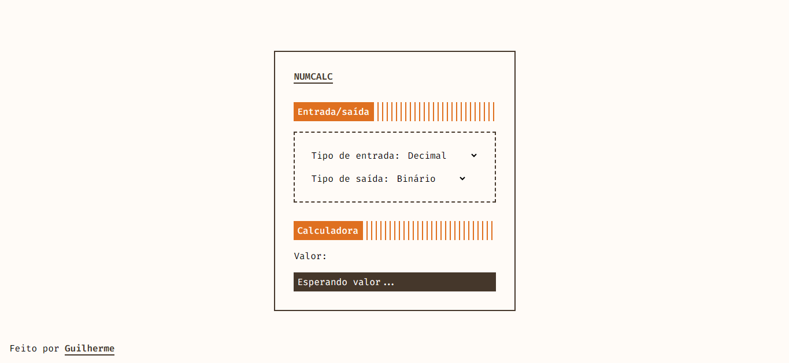

# Numcalc
Numcalc é uma calculadora para conversão de bases numéricas.

## Demo
https://numcalcsd.vercel.app

## Funcionalidades
- Conversão de bases (binário, octal, decimal e hexadecimal);
- Escolhas personalizadas de entrada/saída;
- Resultado em tempo real.

## Tecnologias
- HTML
- CSS
- JavaScript

## Screenshots
.

Feito por: [Nerzzz](https://github.com/Nerzzz)